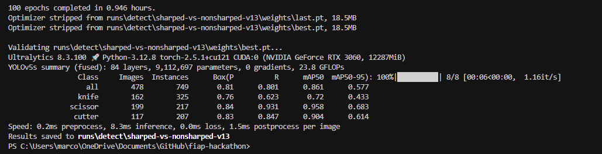
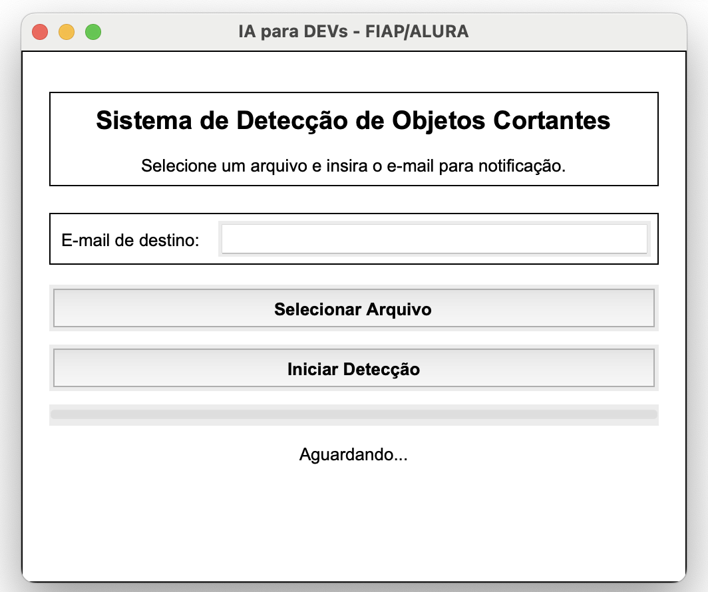

# POS FIAP ALURA - IA PARA DEVS - HACKATHON

## Integrantes Grupo 26

- André Philipe Oliveira de Andrade (RM357002) - andrepoandrade@gmail.com  
- Joir Neto (RM356391) - joirneto@gmail.com  
- Marcos Jen San Hsie (RM357422) - marcosjsh@gmail.com  
- Michael dos Santos Silva (RM357009) - michael.shel96@gmail.com  
- Sonival dos Santos (RM356905) - sonival.santos@gmail.com  

Vídeo (YouTube): https://youtu.be/jWyHVtRH0hs

GitHub: https://github.com/marcosjsh/fiap-hackathon.git

---

# Situação Problema

## Detecção de materiais cortantes

A FIAP VisionGuard, empresa de monitoramento de câmeras de segurança, está analisando a viabilidade de uma nova funcionalidade para otimizar o seu software.
O objetivo da empresa é usar de novas tecnologias para identificar situações atípicas e que possam colocar em risco a segurança de estabelecimentos e comércios que utilizam suas câmeras.
Um dos principais desafios da empresa é utilizar Inteligência Artificial para identificar objetos cortantes (facas, tesouras e similares) e emitir alertas para a central de segurança.
A empresa tem o objetivo de validar a viabilidade dessa feature, e para isso, será necessário fazer um MVP para detecção supervisionada desses objetos.

### Objetivos
- Construir ou buscar um dataset contendo imagens de facas, tesouras e outros objetos cortantes em diferentes condições de ângulo e iluminação;
- Anotar o dataset para treinar o modelo supervisionado, incluindo imagens negativas (sem objetos perigosos) para reduzir falsos positivos;
- Treinar o modelo;
- Desenvolver um sistema de alertas (pode ser um e-mail).

### Entregas
- Documentação detalhando o fluxo utilizado para o desenvolvimento da solução;
- Vídeo de até 15 minutos explicando a solução proposta;
- Link do github do projeto.

---

# 🧠 Por que escolhemos o YOLOv5 para detecção de objetos cortantes?

## 📌 Modelos considerados

Antes de definir o modelo ideal para a detecção de objetos cortantes, avaliamos as seguintes abordagens:

- **YOLOv4**: Um modelo extremamente popular e robusto, ainda muito utilizado em aplicações industriais. Seu desempenho é confiável, especialmente com imagens complexas, mas a configuração e o treinamento costumam ser menos intuitivos em comparação com versões mais modernas.

- **YOLOv5**: Framework de detecção de objetos consolidado, amplamente utilizado na indústria e comunidade científica, com ótimo desempenho em tarefas práticas e excelente compatibilidade com datasets customizados.

- **YOLOv8**: Arquitetura mais recente da linha YOLO, com suporte modular e técnicas avançadas de augmentação. Embora promissor, apresentou resultados inferiores em nossos experimentos com imagens reais.

- **CLIP + SAM / Florence2**: Modelos multimodais voltados a tarefas de classificação, segmentação e análise semântica. Embora impressionantes em capacidades gerais, não se mostraram eficazes para detecção precisa de múltiplos objetos cortantes em imagens reais. Apesar de suas capacidades multimodais, modelos como CLIP e SAM não são projetados nativamente para tarefas de detecção com bounding boxes, sendo mais adequados para classificação sem supervisão ou segmentação interativa

## ⚖️ Comparativo entre modelos

| Modelo         | Prós                                                             | Contras                                                           | Ideal para...                               |
|----------------|------------------------------------------------------------------|-------------------------------------------------------------------|---------------------------------------------|
| **YOLOv4**     | Estável, ainda muito utilizado, bom desempenho geral            | Setup mais complexo, menos integrado com ferramentas modernas     | Ambientes legados ou industriais             |
| **YOLOv5**     | Ótima performance, simples de usar, altamente compatível         | Levemente menos “moderno” que YOLOv8                             | Projetos reais, com datasets customizados    |
| YOLOv8         | Arquitetura moderna, suporte nativo a augmentações              | Desempenho inferior no nosso caso prático                        | Casos onde modularidade é prioridade         |
| CLIP + SAM     | Capacidade multimodal, bom para zero-shot e análise semântica   | Não serve para detecção precisa com bounding boxes               | Classificação ou segmentação exploratória    |
| Florence2      | Potente e versátil                                              | Muito pesado e complexo                                           | Pesquisa avançada e aplicações semânticas    |

---

## 🧬 Comparativo entre variantes do YOLOv5

| Variante      | Parâmetros | Tamanho do Modelo | Velocidade (FPS) | Precisão (mAP@0.5) | Ideal para...                  |
|---------------|------------|-------------------|------------------|--------------------|--------------------------------|
| **YOLOv5n**   | ~1.9M      | 🪶 Muito leve       | 🚀 Muito rápida   | Média              | Edge, mobile, inferência leve |
| **YOLOv5s**   | ~7.5M      | 🧩 Leve             | 🚀 Rápida         | Alta               | Colab, desktop, tempo real     |
| **YOLOv5m**   | ~21.2M     | ⚖️ Média            | ⚡ Boa            | Muito alta         | Servidores, GPUs maiores       |
| **YOLOv5l**   | ~46.5M     | 🏋️ Pesado           | Média             | Excelente          | Treinamento robusto com GPU    |
| **YOLOv5x**   | ~87.7M     | 🧠 Muito pesado     | Lenta             | Altíssima          | Projetos com infraestrutura avançada |

---

## ✅ Resumo da escolha

O **YOLOv5** (variante `s`) foi adotado por apresentar o melhor equilíbrio entre:

- 🚀 Velocidade de inferência
- 🎯 Precisão com nosso dataset específico
- 💻 Compatibilidade com Google Colab + GPU T4
- ⚙️ Simplicidade de uso e integração com ferramentas modernas

# Montagem do dataset


## 🧩 Montagem e Unificação do Dataset de Objetos Cortantes

Para garantir um bom desempenho do modelo YOLOv5 mesmo em ambientes com recursos computacionais limitados, foi necessário dedicar um pouco mais de esforço à montagem de um **dataset pequeno, mas com boa qualidade e diversidade**. A ideia foi garantir representatividade visual com variações de **ângulo, iluminação, contexto e tipos de objetos cortantes**, sem sobrecarregar o processo de treinamento.

---

## 🔍 Por que usar o Roboflow Universe?

A ferramenta [Roboflow Universe](https://universe.roboflow.com/) foi escolhida por vários motivos:

- ✅ Disponibilidade de **diversos datasets rotulados** de forma pública e gratuita
- ✅ Interface prática para **pré-visualização**, **filtragem por classe** e **download no formato YOLOv8**
- ✅ Suporte para **datasets por versão**, mantendo controle das origens
- ✅ Facilidade de exportação padronizada (`images/` e `labels/` por split)

---

### 📥 1. Coleta dos Datasets

Realizou-se uma **pesquisa ativa por conjuntos de dados públicos no Roboflow Universe**, com foco nas seguintes classes:

```python
["knife", "scissor", "cutter"]
```

Cada classe foi buscada individualmente, selecionando projetos com imagens reais, bounding boxes precisos e variações visuais significativas. Os datasets foram então baixados e organizados em pastas separadas por classe.
A contagem original de arquivos é a seguinte:

#### 📂 Train
| Categoria    | Imagens |
|--------------|---------|
| knife        | 1627    |
| scissor      | 2050    |
| cutter       | 862     |

#### 📂 Valid
| Categoria    | Imagens |
|--------------|---------|
| knife        | 162     |
| scissor      | 199     |
| cutter       | 117     |

#### 📂 Test
| Categoria    | Imagens |
|--------------|---------|
| knife        | 72      |
| scissor      | 100     |
| cutter       | 31      |


---

### 🧩 2. Unificação dos Datasets

Como os datasets coletados possuíam diferentes **estruturas e índices de classes**, tornou-se necessário unificá-los.

Para isso, foi utilizado o script `unificar-dataset-e-atualizar-indice-e-subsampling.py`, presente na pasta `tools`, que:

- 🗃️ Agrupa todos os arquivos em uma estrutura comum (`test/images`, `train/images`, `valid/images`)
- 🔄 Atualiza os arquivos de rótulo `.txt` para refletirem os **índices padronizados**

Essa etapa garante que os dados estejam **prontos para o treinamento em YOLOv5**, com consistência entre `data.yaml`, as imagens e os rótulos.

---

### ✂️ 3. Subsampling durante a unificação

Durante o processo de unificação, foi aplicado um **subsampling** para limitar a quantidade de exemplos das categorias knife e scissor:

- 🔁 **Máximo de 1.000 imagens para as categorias alvo**
- 🎯 Isso evita sobrecarregar a memória e acelera o processo de treinamento
- ⚖️ Ajuda a **balancear o dataset**, evitando que uma classe como `"knife"` e `"scissor"` domine o aprendizado

---

#### Resultado do Subsampling

##### 📂 Train
| Categoria    | Imagens |
|--------------|---------|
| knife        | 1000    |
| scissor      | 1000    |
| cutter       | 862     |


Também foram adicionados ao dataset de train, cerca de 100 imagens de botas e grampeadores com o intuito de sujar o dataset.


##### 📂 Valid
| Categoria    | Imagens únicas |
|--------------|----------------|
| knife        | 162            |
| scissor      | 199            |
| cutter       | 177            |


# 🧪 Superaugmentação de Dados com Albumentations para YOLOv5

A superaugmentação de datasets é fundamental para melhorar a performance de modelos como o YOLOv5, especialmente em cenários com poucos dados. Ela amplia artificialmente o conjunto de imagens por meio de transformações como rotações, mudanças de brilho, cortes, ruídos e variações geométricas. Isso ajuda o modelo a aprender a detectar objetos sob diferentes condições, evitando o overfitting e melhorando sua capacidade de generalização para situações do mundo real.

Além disso, a superaugmentação torna o detector mais robusto, simulando variações que os objetos podem apresentar em contextos reais, como diferentes fundos, iluminações, ângulos e oclusões. Assim, o modelo se torna mais confiável em aplicações práticas, como segurança, onde objetos como facas e tesouras podem aparecer de formas imprevisíveis.

Obs: O nosso dataset enviado neste repositório já conta com superaugmentação.

---

## 🏋️‍♂️ Treinamento

```python
model.train(
    data='/content/drive/dataset/data.yaml',
    epochs=100,
    imgsz=640,
    batch=32,
    device=0,
    workers=2,
    name='sharped-vs-nonsharped-v1',
    pretrained=True,
    augment=True,
    mosaic=1.0,
    mixup=0.2,
    hsv_h=0.015, hsv_s=0.7, hsv_v=0.4,
    flipud=0.3, fliplr=0.5,
    degrees=10.0, translate=0.1, scale=0.5, shear=2.0,
    patience=20
)
```

### ✅ Parâmetros explicados:

| Parâmetro         | Significado                                                                 |
|------------------|-----------------------------------------------------------------------------|
| `data`           | Caminho para o arquivo `data.yaml` com caminhos e nomes das classes         |
| `epochs`         | Número máximo de épocas de treinamento                                      |
| `imgsz`          | Tamanho da imagem (redimensionamento para 640x640)                          |
| `batch`          | Tamanho do batch (quantidade de imagens por iteração)                      |
| `device`         | GPU a ser usada (`0` para a primeira GPU disponível)                        |
| `workers`        | Número de workers para carregar dados em paralelo                           |
| `name`           | Nome do experimento (usado para salvar logs, pesos e métricas)              |
| `pretrained`     | Usa pesos pré-treinados do COCO (se `True`)                                 |
| `augment`        | Ativa augmentações básicas (como flips e mudanças de brilho/contraste)      |
| `mosaic`         | Ativa **Mosaic augmentation** (1.0 = 100% das imagens usam mosaic)          |
| `mixup`          | Ativa **MixUp augmentation** com 20% de intensidade                         |
| `hsv_h/s/v`      | Variações de tonalidade, saturação e brilho                                 |
| `flipud`         | Probabilidade de flip vertical                                              |
| `fliplr`         | Probabilidade de flip horizontal                                            |
| `degrees`        | Rotação aleatória de até ±10°                                               |
| `translate`      | Translação aleatória de até 10%                                             |
| `scale`          | Escala aleatória de até ±50%                                                |
| `shear`          | Inclinação aleatória de até 2°                                              |
| `patience`       | Número de épocas sem melhoria antes do Early Stopping                       |

---

## 🎯 Objetivo do modelo

Detectar objetos cortantes vs. não cortantes, usando imagens balanceadas, com múltiplas classes (como `knife`, `scissor` e `cutter`)

## Resultados do treinamento



Avaliando o nosso treinamento, podemos ver que:
O modelo YOLOv5s foi treinado por 100 épocas e teve um desempenho muito bom, especialmente considerando que se trata de uma versão leve da arquitetura. A validação mostrou uma média de precisão (mAP@0.5) de 86%, com destaque para a classe tesouras, que alcançou incríveis 95% de mAP. Isso mostra que o modelo aprendeu muito bem a identificar esse tipo de objeto.

A classe estilete também teve uma performance consistente, com 90% de mAP e boa revocação. Já a classe faca ficou um pouco abaixo, com 72% de mAP e uma revocação mais baixa. Isso pode indicar que o modelo ainda tem dificuldades para reconhecer facas em certos contextos.

No geral, os resultados são positivos. A inferência está muito rápida, com apenas 1.5ms por imagem, o que torna o modelo ideal para aplicações em tempo real. Com pequenos ajustes no dataset ou nos dados da classe knife, o desempenho pode melhorar ainda mais.


# Instruções de Uso

## 🧰 Tecnologias Utilizadas

- [Python 3.8+](https://www.python.org/) (Recomendamos Python 3.12 caso o OS seja MacOS, devido a um bug de exibição da interface produzida com Tkinter)
- [YOLOv5 (Ultralytics)](https://github.com/ultralytics/yolov5)
- OpenCV
- Tkinter
- Torch (PyTorch)
- SMTP (para envio de e-mails)

---

## 🚀 Instalação e Execução

### 1. Clone o repositório

```bash
git clone https://github.com/marcosjsh/fiap-hackathon.git
cd fiap-hackathon
```

### 2. (Recomendado) Crie e ative um ambiente virtual

```bash
python -m venv venv
# Windows
venv\Scripts\activate
# macOS/Linux
source venv/bin/activate
```

### 3. Instale as dependências

```bash
pip install -r requirements.txt
```

> ⚠️ O `torch` pode ser instalado com suporte a GPU, se desejar:
> Consulte https://pytorch.org/get-started/locally/

---

## 📁 Arquivos Esperados

Coloque seu modelo YOLOv5 treinado com nome `best.pt` na raiz do projeto:

```
fiap-hackathon/
├── main.py
├── best.pt  ✅
├── requirements.txt
```

---

## ✉️ Configuração do E-mail (Gmail)

1. Acesse: [https://myaccount.google.com/apppasswords](https://myaccount.google.com/apppasswords)
2. Gere uma senha de app para "Correio" ou "E-mail"
3. No seu código `main.py`, edite:

```python
email_user = "seuemail@gmail.com"
email_cod = "SENHA_DO_APP"
```

---

## ▶️ Como Usar

1. Execute o programa:

```bash
python main.py
```

2. Na interface:
   - Digite um e-mail de destino
   - Selecione uma **imagem** ou **vídeo**
   - Clique em "Iniciar Detecção"
   - Se houver detecção, o sistema envia os resultados por e-mail

---

## ✅ Formatos Suportados

- **Imagens:** `.jpg`, `.jpeg`, `.png`, `.bmp`
- **Vídeos:** `.mp4`, `.avi`, `.mov`, `.mkv`

---

## 📦 Estrutura de Pastas

```
frames_detectados/   # Armazena os frames/imagens com detecção
best.pt              # Seu modelo treinado YOLOv5
main.py              # Código principal com GUI
requirements.txt     # Dependências
```

---

## 🛠 Possíveis Melhorias

- Suporte a múltiplos arquivos de entrada
- Integração com banco de dados/logs
- Escolha de parâmetros como `conf`, `iou` via interface
- Compatibilidade com diferentes provedores de e-mail

---

## 📸 Prévia da Interface



---

## 📄 Licença

Este projeto é de livre uso para fins acadêmicos ou pessoais. Sinta-se à vontade para modificar.
